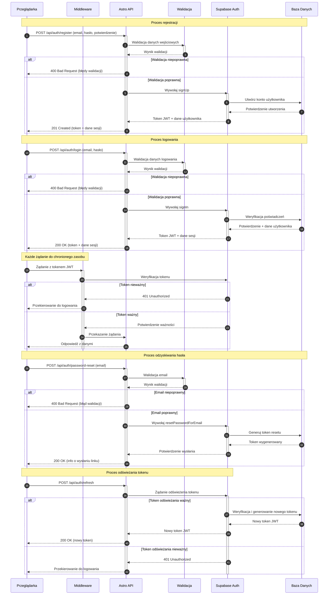

```mermaid
sequenceDiagram
    autonumber
    participant B as Przeglądarka
    participant M as Middleware
    participant API as Astro API
    participant V as Walidacja
    participant SA as Supabase Auth
    participant DB as Baza Danych

    %% Rejestracja
    Note over B,DB: Proces rejestracji
    B->>API: POST /api/auth/register (email, hasło, potwierdzenie)
    activate API
    API->>V: Walidacja danych wejściowych
    activate V
    V-->>API: Wynik walidacji
    deactivate V
    alt Walidacja niepoprawna
        API-->>B: 400 Bad Request (błędy walidacji)
    else Walidacja poprawna
        API->>SA: Wywołaj signUp
        activate SA
        SA->>DB: Utwórz konto użytkownika
        DB-->>SA: Potwierdzenie utworzenia
        SA-->>API: Token JWT + dane użytkownika
        deactivate SA
        API-->>B: 201 Created (token + dane sesji)
    end
    deactivate API

    %% Logowanie
    Note over B,DB: Proces logowania
    B->>API: POST /api/auth/login (email, hasło)
    activate API
    API->>V: Walidacja danych logowania
    activate V
    V-->>API: Wynik walidacji
    deactivate V
    alt Walidacja niepoprawna
        API-->>B: 400 Bad Request (błędy walidacji)
    else Walidacja poprawna
        API->>SA: Wywołaj signIn
        activate SA
        SA->>DB: Weryfikacja poświadczeń
        DB-->>SA: Potwierdzenie + dane użytkownika
        SA-->>API: Token JWT + dane sesji
        deactivate SA
        API-->>B: 200 OK (token + dane sesji)
    end
    deactivate API

    %% Middleware i autoryzacja
    Note over B,M: Każde żądanie do chronionego zasobu
    B->>M: Żądanie z tokenem JWT
    activate M
    M->>SA: Weryfikacja tokenu
    alt Token nieważny
        SA-->>M: 401 Unauthorized
        M-->>B: Przekierowanie do logowania
    else Token ważny
        SA-->>M: Potwierdzenie ważności
        M->>API: Przekazanie żądania
        API-->>B: Odpowiedź z danymi
    end
    deactivate M

    %% Odzyskiwanie hasła
    Note over B,DB: Proces odzyskiwania hasła
    B->>API: POST /api/auth/password-reset (email)
    activate API
    API->>V: Walidacja email
    activate V
    V-->>API: Wynik walidacji
    deactivate V
    alt Email niepoprawny
        API-->>B: 400 Bad Request (błąd walidacji)
    else Email poprawny
        API->>SA: Wywołaj resetPasswordForEmail
        activate SA
        SA->>DB: Generuj token resetu
        DB-->>SA: Token wygenerowany
        SA-->>API: Potwierdzenie wysłania
        deactivate SA
        API-->>B: 200 OK (info o wysłaniu linku)
    end
    deactivate API

    %% Odświeżanie tokenu
    Note over B,SA: Proces odświeżania tokenu
    B->>API: POST /api/auth/refresh
    activate API
    API->>SA: Żądanie odświeżenia tokenu
    activate SA
    alt Token odświeżania ważny
        SA->>DB: Weryfikacja i generowanie nowego tokenu
        DB-->>SA: Nowy token JWT
        SA-->>API: Nowy token JWT
        API-->>B: 200 OK (nowy token)
    else Token odświeżania nieważny
        SA-->>API: 401 Unauthorized
        API-->>B: Przekierowanie do logowania
    end
    deactivate SA
    deactivate API
``` 